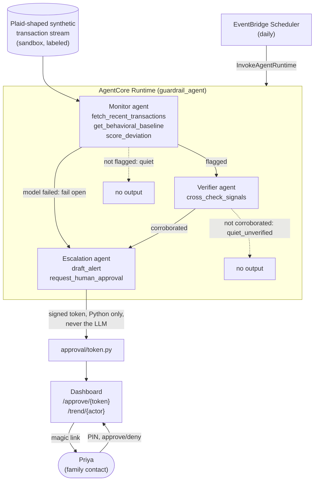

# Guardrail

An agent that watches an elderly parent's bank account on behalf of her family,
not her bank. Built for the Agents for Humans AWS hackathon on the Strands
Agents SDK, deployed on Amazon Bedrock AgentCore Runtime.

Sarla is 78. Her daughter Priya lives 2,000 miles away. Every morning three
Strands agents check Sarla's transactions against her own normal. On most days
they find nothing and say nothing. When something looks like a scam (a burst of
gift cards after an "emergency" call, one large wire to a stranger, a
remote-access purchase followed by an ATM run) the pipeline drafts a
plain-language message and asks Priya before anyone acts. The model never does
the math and can never send.

## Judges: the five-minute path

```bash
git clone <repo> && cd guardrail
python -m venv .venv && source .venv/bin/activate
pip install -e ".[dev]"
python scripts/sweep.py    # every scenario through the real detection core: ~1s, zero credentials
pytest                     # 47 tests: routing, tokens, rules, fail-open — no AWS needed
```

The sweep prints the verdict table for all six scenarios (quiet days stay
quiet, four scam shapes escalate) using the exact detection code the deployed
agents call as tools. What the AI is never allowed to do, and where each rule
is enforced, is one short read: [CONSTITUTION.md](CONSTITUTION.md).

To run against a live model you need AWS credentials in `us-east-1` with
`bedrock:InvokeModel` on `amazon.nova-pro-v1:0` (no model-access form for Nova).

```bash
AWS_PROFILE=<yours> python scripts/run_local.py --scenario quiet_day          # silence
AWS_PROFILE=<yours> python scripts/run_local.py --scenario grandparent_scam   # escalation + token
uvicorn guardrail.dashboard.server:app --app-dir src --port 8000             # /trend/<actor>, /approve/<token>
```

Demo PIN is `000000`. The deployed runtime is
`arn:aws:bedrock-agentcore:us-east-1:156470788861:runtime/guardrail_agent-oO0Y9nFhQs`;
EventBridge Scheduler `guardrail-daily-check` invokes it once a day.

## Pipeline

`Monitor -> Verifier -> Escalation`, gated. Verifier only runs if Monitor
flags. Escalation only runs if Verifier corroborates. If Monitor or Verifier
fails outright (model error, Bedrock down) the pipeline fails open toward a
human: escalate, don't go quiet. `tests/test_pipeline_stubbed.py` drives every
route with fake agents.



What each agent does, and what it is not allowed to do:

- **Monitor** calls three tools in order. `score_deviation` is deterministic
  Python: gift-card burst, outsized wire, remote-access purchase plus ATM
  withdrawal. The model is instructed to report the tool's result exactly, and
  `run_monitor` uses `structured_output_model` on a normal invocation because
  the deprecated `agent.structured_output()` was observed skipping the tool
  loop entirely and guessing.
- **Verifier** calls `cross_check_signals`, a separate lookup that maps
  Monitor's signal kinds to named scam patterns. Today it is a second
  deterministic check, not an independent analysis; the section below on
  what's next says what would make it one.
- **Escalation** calls `draft_alert` and `request_human_approval`. It cannot
  send anything. `run_escalation` mints the real token in Python after the
  agent's loop, whatever the agent did, so an Alert always carries a
  correctly-scoped token.

## Approval

`request_human_approval` issues an HMAC-SHA256 signed, single-use token with a
15-minute TTL, keyed by `token_id`. The link opens a redacted page (no amounts,
no merchants). A memorized PIN unlocks the evidence trail. Five wrong PINs burn
the token; a burned or redeemed token is never re-issued or extended.
Redemption is locked, so two clicks on the same link yield exactly one
success. See `tests/test_approval_tokens.py`.

## Why not Strands Graph

Graph is the right topology; the diagram above is the graph. It is not what
runs because Graph's edges forward each node's free-text output, and this
pipeline needs every handoff to be exact JSON (a live Nova Pro run emitted
malformed tool arguments when a Python repr was embedded in a prompt) and
every gate to be testable without a model call. So the edges are ~40 lines of
Python with pydantic contracts and the nodes are unchanged Strands Agents.
Full reasoning at the top of `src/guardrail/graph.py`.

## What is real and what is sandboxed

Real and verified live: the three Strands agents and their tools, the AgentCore
container deployment, the daily schedule, the token flow, the trend view, fail
open on model failure.

Sandboxed or stubbed, and labeled as such in code: the transaction stream
(`synthetic/`, Plaid-shaped, no real bank), the credential broker
(`identity/broker.py` returns a placeholder; the AgentCore Identity exchange it
stands in for is described in its docstring), notification
(`approval/channel.py` prints the link instead of calling SNS), and storage
(tokens, baselines, and trend rows are in-process dicts; a container restart
clears them). One demo PIN, one elder. Each is a swap, not a rewrite, and none
of them is hidden behind a feature flag.

## Detection rules

Four patterns today, all in `tools/baseline_tools.py::score_deviation`,
each with a test in `tests/test_score_deviation.py`:

| Pattern | Signature |
|---|---|
| Gift-card burst (grandparent, IRS impersonation) | 2+ gift-card merchants in one run |
| Romance / advance-fee wire | one wire over 10x the baseline median |
| Tech-support | MCC 7379 remote-access purchase plus an ATM withdrawal in the same run |

## Layout

```
src/guardrail/
  app.py                 AgentCore entrypoint (container, /invocations)
  graph.py               routing: the gates, fail-open, run_pipeline
  agents/                monitor, verifier, escalation (Strands Agents)
  tools/                 @tool functions; all deterministic
  approval/token.py      HMAC tokens, PIN attempts, single-use, locked
  approval/channel.py    notify() stub
  dashboard/server.py    FastAPI: /approve/{token}, /trend/{actor}
  memory/manager.py      baselines + trend rows (in-process)
  synthetic/             scenarios and the baseline generator
  identity/broker.py     credential broker stub
infra/iam/               the three roles as deployed
scripts/                 run_local, seed_sandbox, setup_scheduler
tests/                   30 tests, no AWS required
```

## License

MIT.
