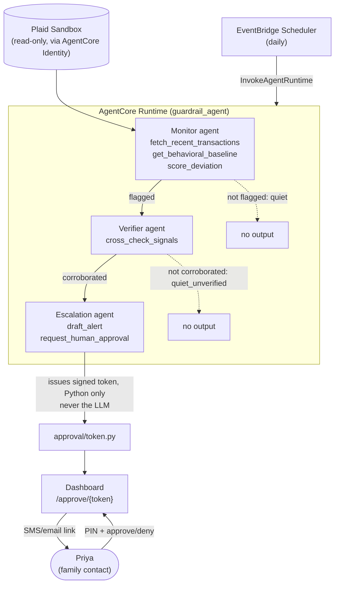

# Guardrail

Elder financial fraud watch agent, built for the Agents for Humans AWS hackathon.
Priya Nair's mother Sarla is watched by a silent 3-agent Strands pipeline; Priya
only hears from it when a scam-shaped anomaly is independently corroborated twice.

Full strategy, debate history, and the resolved architecture spec this scaffold
implements live in the project's two published docs (build strategy, architecture spec).

## Pipeline

`Monitor -> Verifier -> Escalation`, gated: Verifier only runs if Monitor flags,
Escalation only runs if Verifier corroborates. Silence is the default outcome on
almost every day. See [`src/guardrail/graph.py`](src/guardrail/graph.py).



Two things this diagram is being honest about: the model never touches
`approval/token.py` directly (that's the actual security boundary, not
decoration), and both "nothing happened" exits are first-class, not
error paths -- silence is the intended outcome on almost every run.

## Setup

```bash
python -m venv .venv && source .venv/bin/activate
pip install -e ".[dev]"
cp .env.example .env  # fill in AWS + Plaid sandbox creds when you have them
pytest                # routing + token logic — needs zero AWS credentials
python scripts/seed_sandbox.py
python scripts/run_local.py --scenario grandparent_scam
```

## Day-1 spike — done, checked against strands-agents 1.52.0

Verified by installing `strands-agents` and `bedrock-agentcore` into a real venv
and introspecting the classes directly, not by reading docs:

- `Agent(model=..., system_prompt=..., tools=[...])` and
  `Agent.structured_output(Model, prompt=...)` — confirmed, exact match to this
  scaffold's usage.
- `BedrockModel(model_id=..., region_name=...)` — confirmed, both kwargs are real
  (`model_id` lives in `BedrockModel.BedrockConfig`, `region_name` is a direct
  constructor param).
- `strands.multiagent.GraphBuilder` — `add_node`, `add_edge(condition=...)`,
  `set_entry_point` all exist as assumed, **but** the intended condition pattern
  (`state.results["monitor"].get_output()`) was wrong — that method doesn't exist.
  The real path is `NodeResult.get_agent_results()[0].structured_output`.
- Bigger finding: `Graph.__call__(task, ...)` propagates one shared task through
  the whole run — it has no native way to hand a node a distinct, code-built
  prompt derived from the previous node's typed output, which this pipeline
  needs (Verifier must see Monitor's specific signals, not just the original
  task). So `Graph` is **not used** for the deployed pipeline. See
  [`graph.py`](src/guardrail/graph.py) for the full reasoning — `run_pipeline()`,
  plain Python with explicit per-node prompts, is what's actually deployed.

## What's deliberately not built here (see the architecture spec for why)

Real bank OAuth, real SMS/email send (channel.py logs instead of calling SNS),
multi-elder support, a native phone app, a trained anomaly model, persistent storage
for tokens/baselines (in-memory only — fine for a single-process demo, not for
production). Each cut is a one-line change to lift, not a rewrite.

## Security notes for anyone extending this

- `send_alert`-equivalent logic never runs inside the LLM's tool-call loop — token
  issuance happens deterministically in Python (`approval/token.py`), called again
  by `run_escalation()` regardless of whether the agent's own tool call succeeded,
  so an Alert always carries a real, correctly-scoped token.
- No tool anywhere has write/transfer capability. Read-only, everywhere.
- `get_plaid_sandbox_token` raises `ActorMismatch` rather than silently resolving
  a wrong actor — this is the one place a bug or prompt-injected `actor_id` swap
  would actually matter.
